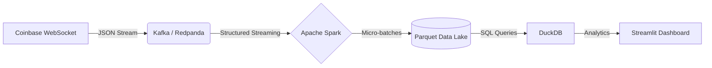
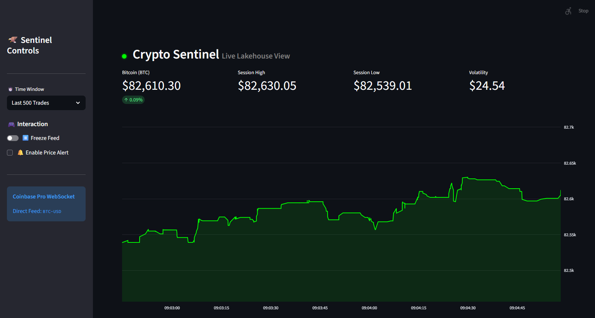

# 🦅 Crypto Sentinel: Real-Time Data Lakehouse

[](http://165.232.153.250:8501/)


**Crypto Sentinel** is an end-to-end streaming data engineering pipeline that ingests, processes, and visualizes cryptocurrency market data in real-time. It processes raw WebSocket frames, streams them through Kafka and Spark, commits them to a Parquet Data Lake, and serves live analytics via a DuckDB + Streamlit dashboard.

---

## 🏗️ Architecture

The pipeline follows a modern **Lakehouse Architecture**:


## 🔧 Tech Stack

| Component | Technology | Description |
| :--- | :--- | :--- |
| **Ingestion** | **Python** | Coinbase Pro WebSocket API client |
| **Message Broker** | **Redpanda** | Kafka-compatible, low-latency log storage |
| **Processing** | **Apache Spark** | Structured Streaming for micro-batching |
| **Storage** | **Parquet** | Columnar storage (Local Data Lake) |
| **Serving Layer** | **DuckDB** | In-process SQL OLAP for high-speed reads |
| **Visualization** | **Streamlit** | Real-time interactive UI with Plotly |
| **Infrastructure** | **Docker** | Container orchestration |

## 🌟 Key Features

* **⚡ Sub-Second Latency:** Data travels from ingestion to dashboard in **<1 second**.
* **⏸️ Freeze Mode:** "Matrix-style" pause feature allows users to halt the live feed to inspect historical spikes without losing the data connection.
* **🚨 Price Alerts:** Real-time visual monitoring system that triggers a "Red Alert" UI flash when assets hit target thresholds.
* **🛡️ Robust Error Handling:** Auto-recovery logic for network drops and Spark micro-batch processing delays.
* **📜 Smooth Scrolling:** Implements Streamlit Fragments (`@st.fragment`) to allow independent component refreshing without page reloads.


## 🚀 Quick Start

### Prerequisites
* Docker & Docker Compose installed on your machine.

### Installation

**1. Clone the repository**
```bash
git clone [https://github.com/your-username/crypto-sentinel.git](https://github.com/your-username/crypto-sentinel.git)
cd crypto-sentinel
```

**2. Start the Pipeline**
This spins up the entire cluster (Spark Master, Worker, Kafka, Zookeeper, Dashboard).
```bash
docker compose up -d --build
```

**3. Initialize the Spark Job**
Submit the streaming job to the Spark Master container:
```bash
docker exec -d crypto-spark-master /opt/spark/bin/spark-submit \
  --packages org.apache.spark:spark-sql-kafka-0-10_2.12:3.5.0 \
  --master spark://spark-master:7077 \
  /opt/spark/work-dir/spark_processor.py
```

**4. Access the Dashboard**
Open your browser and navigate to: http://localhost:8501


## 📂 Project Structure

```bash
crypto-sentinel/
├── dashboard.py         # Streamlit UI with DuckDB integration
├── spark_processor.py   # Spark Structured Streaming logic
├── producer.py          # WebSocket ingestion to Kafka
├── docker-compose.yml   # Container orchestration
├── requirements.txt     # Python dependencies
├── .dockerignore        # Build optimization
└── spark_data/          # Local Data Lake (Parquet files)
```

## 🧠 Engineering Challenges Solved

### 1. The "Small File" Problem
* **Problem:** Spark Streaming often creates tiny files that choke downstream readers.
* **Solution:** Implemented file size filtering and robust read logic in DuckDB to ignore incomplete "ghost" files.

### 2. UI Jitter & Scroll Reset
* **Problem:** High-frequency updates typically make web UIs unusable.
* **Solution:** Utilized **Streamlit Fragments** to isolate the chart re-render loop, enabling smooth scrolling while data updates at 1Hz.

### 3. Docker Build Latency
* **Problem:** The data lake grows to GBs in size, slowing down context transfer.
* **Solution:** Optimized Docker context with `.dockerignore` to prevent build context explosion.

## 📸 Screenshots

**

---

**Author:** Yash Rupani
**License:** MIT
