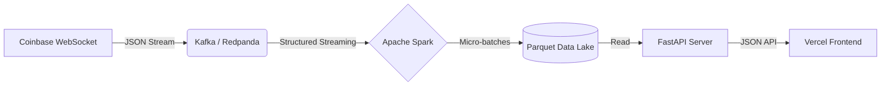

# 🦅 Crypto Sentinel: Real-Time Data Lakehouse (Backend)

[](https://crypto-frontend-puce-theta.vercel.app/)


**Crypto Sentinel** is a high-throughput distributed data engineering pipeline. It ingests cryptocurrency market data via WebSockets, processes it with Apache Spark Structured Streaming, and exposes a low-latency JSON API for frontend consumption.

**This is the Backend Engine.** For the User Interface, see the [Frontend Repository](https://github.com/YOUR_USERNAME/crypto-frontend).

---

## 🏗️ Architecture

The pipeline follows a **Decoupled Microservices Architecture**:


## 🔧 Tech Stack

| Component | Technology | Description |
| :--- | :--- | :--- |
| **Ingestion** | **Python** | Coinbase Pro WebSocket API client |
| **Message Broker** | **Redpanda** | Kafka-compatible, low-latency log storage |
| **Processing** | **Apache Spark** | Structured Streaming for micro-batching |
| **Storage** | **Parquet** | Columnar storage (Local Data Lake) |
| **Serving Layer** | **FastAPI** | In-process SQL OLAP for high-speed reads |
| **Server** | **Uvicorn** | Real-time interactive UI with Plotly |
| **Infrastructure** | **Docker** | Container orchestration |

## 🌟 Key Features

* **⚡ Headless Architecture:** Decoupled backend allows for independent scaling of data processing and UI rendering.
* **🦅 Low-Latency API:** FastAPI endpoint serves the latest market state in <50ms.
* **🛡️ Fault Tolerance:** Auto-recovery logic for Kafka connection drops and Spark streaming failures.
* **💾 Efficient Storage:** Uses Parquet columnar format for 90% compression vs CSV.
* **🐳 Fully Containerized:** One-command deployment via Docker Compose.


## 🚀 Quick Start

### Prerequisites
* Docker & Docker Compose installed on your machine.
* 4GB+ RAM (if running Spark).

### Installation

**1. Clone the repository**
```bash
git clone [https://github.com/your-username/crypto-sentinel.git](https://github.com/your-username/crypto-sentinel.git)
cd crypto-sentinel
```

**2. Start the Pipeline**
This spins up the entire cluster (Spark Master, Worker, Kafka, Zookeeper, API).
```bash
docker compose up -d --build
```

**3. Initialize the Spark Job**
Submit the streaming job to the Spark Master container:
```bash
docker exec -d crypto-spark-master /opt/spark/bin/spark-submit \
  --packages org.apache.spark:spark-sql-kafka-0-10_2.12:3.5.0 \
  --master spark://spark-master:7077 \
  /opt/spark/work-dir/spark_processor.py
```

**4. Test the API**
Check if the backend is serving data:
```bash
curl http://localhost:8000/latest
```

## ⚠️ Production Deployment Requirements

This project is optimized for streaming data. If running on a **4GB RAM Server** (e.g., DigitalOcean Droplet, AWS t2.medium), you **must** enable Swap Memory to prevent Spark from crashing the OS.

**1. Enable Swap (Run once on server):**
```bash
fallocate -l 4G /swapfile && \
chmod 600 /swapfile && \
mkswap /swapfile && \
swapon /swapfile && \
echo '/swapfile none swap sw 0 0' | tee -a /etc/fstab
```

**2. Automated Maintenance**
To prevent the Data Lake from filling the disk, add a cron job to delete data older than 7 days:
```bash
0 0 * * * find /path/to/repo/spark_data/storage -type f -mtime +7 -delete
```

## 📂 Project Structure

```bash
crypto-sentinel/
├── api.py               # FastAPI Serving Layer (Replaces Dashboard)
├── spark_processor.py   # Spark Structured Streaming logic
├── connector.py         # WebSocket ingestion to Kafka
├── docker-compose.yml   # Container orchestration
├── requirements.txt     # Python dependencies
└── spark_data/          # Local Data Lake (Parquet files)
```

## 🧠 Engineering Challenges Solved

### 1. Moving from Streamlit to FastAPI
* **Problem:** Streamlit consumes excessive RAM (1GB+) for simple rendering, causing crashes on small servers.
* **Solution:** Migrated to a **Headless API** architecture. The heavy visualization work is offloaded to the client's browser (React/Vercel), while the server only handles raw JSON data.

### 2. The "Small File" Problem
* **Problem:** Spark Streaming creates tiny files that choke downstream readers.
* **Solution:** Implemented file sorting logic in the API layer to only read the single most recent Parquet partition, ensuring O(1) read time regardless of lake size.

---

**Author:** Yash Rupani
**License:** MIT
